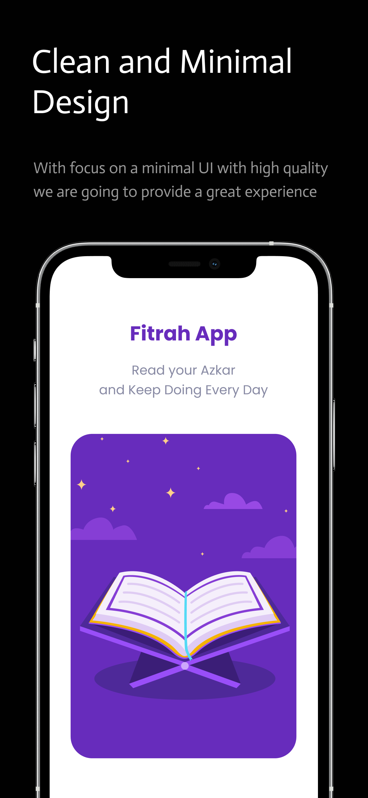
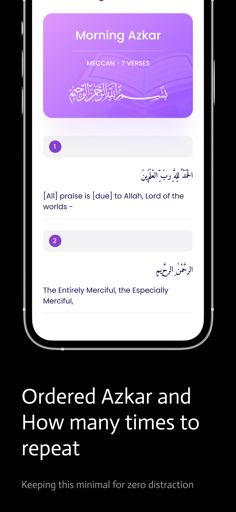
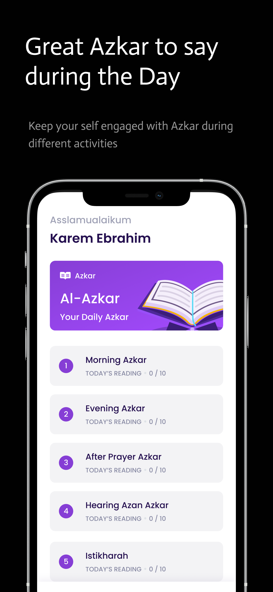

---
# https://vitepress.dev/reference/default-theme-home-page
layout: home

hero:
  name: "Fitrah"
  text: "Azkar, Duaa, and Quran for Muslims"
  tagline: Focused on Quality and Privacy
  actions:
    - theme: brand
      text: Github Repository
      link: https://github.com/KarimEbrahemAbdelaziz/Fitrah
    - theme: alt
      text: Quick Start
      link: /quick_start

features:
  - title: Open Source Project
    details: It's built by the community for the community and may Allah accept for us.
  - title: High Quality
    details: With focus on User Experience and Interface and building it with best practices out there.
  - title: Ad Free App
    details: It's a religon app and we don't aim to make a profit from it, never.
---

  
  
  

